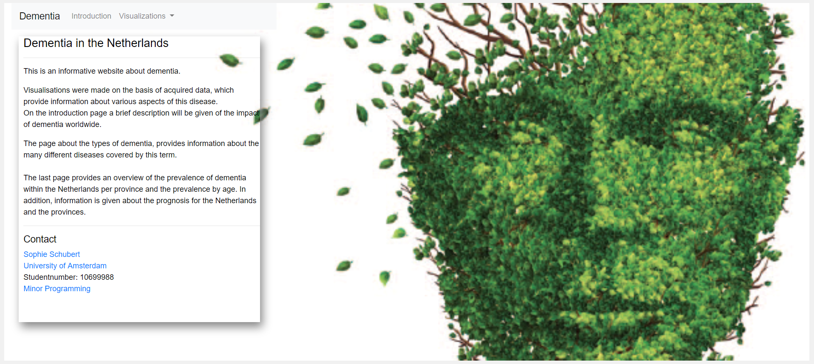

# Programming Project - A visualisation of dementia
Course: Programmeerproject  
Name: Sophie Schubert  
Student number: 10699988

## [Click here for the github website](https://ElineSophie.github.io/Project/)  

## Product Goal  
Dementia is a global problem. According to various prognoses, the number of dementia patients will increase to a large extent. For this increase, different reasons are given. One main reason is the aging population.
The idea for this project is to provide information about the disease and the impact worldwide. On the other hand, information will be given
about the rates of dementia in the Netherlands in relationship with aging population. The number of people with dementia are shown in a map of the Netherlands and also in a scatterplot, against aging rates. Thereby, a prognosis is given for each province till 2050.

## Website Walkthrough  
#### Homepage  
The website consists of a main homepage that shows the navigation bar at the top of the page, followed by the title of my project and information about my webpage and contactinfo, all projected on an image. The navigation bar contains the links to other pages of the website.
  

#### Introduction page
This page consists also the same navigation bar as the homepage.
On the left of the website, a small introduction into my problem is given. The story begins generally, namely what the prognosis is for dementia worldwide. There are two line graphs that support the story. The usage for the two line graphs is described in short under the section *usage*. For both line graphs, it is shown that the number of people with dementia is rising for higher income countries and Europe. The Netherlands belongs under both the income countries en Europe category. This leads to the question what the impact of dementia is in the Netherlands.
The user can click on the visualisation page that covers up this question, however, the user can also click on the other visulisation page; namely types of dementia.

#### Visualisation page about the types of dementia
Also on this page, the same navigation bar is on the top of the site.
As in the introduction page, a small description is given on the left of the page about the types of dementia. This is supported by a pie chart in the middle of the page. Above the pie chart, there is a very short description under the section *usage* about the visualisation. Under this brief description, the data source is given.

#### Visualisation page about the Netherlands and dementia
Also on this page, the same navigation bar is on the top of the site.
This page is the most interesting page of the website. It contains all the data visualizations that covers the problem statement that was given at the introduction page. At the left, there is again a brief introduction supported by the visulisations.
Above the visualisations, a *usage* description is given about how to handle the visualisations and how the visualisations are connected to each other. Next to the usage section, there is a menu. In the menu, the user can make a choice which data is being shown in the map and scatterplot. The choices that the user can make are:
- Ongoing DTC (Diagnosis Treatment Combination) or closed DTC.
- Total men/women, only men or only women.
- For the gender choice: 65+ or 80+.
- The year (2009 - 2016).
- A reset button that will reload the page.

The first visualisation is a map of the Netherlands showing provinces. The provinces are color coded (in blue) to the number of people with dementia per 100.000 inhabitants. A darker color of blue indicates a higher number of people per 100.000 inhabitants. The map holds a tooltip, where you can see the exact amount of this number when you hover over the provinces with your mouse. The map contains also a click function, which will update two other visualisations at the end of the page.
At the right side of the map, a scatterplot is being presented. On the x-axis of the scatterplot, the number of people with dementia per 100.000 inhabitants is given. The aging rate is on the y-axis. Also in this visualisatoin, the provinces are color coded (in blue) to the number of people with dementia per 100.000 inhabitants (with the same index as the map).
The dots hold a tooltip, where you can see the exact amount of people and the aging rate when you hover with your mouse over these dots. Clicking on the dots will update one of the two graphs at the end of the page.

When scrolling down at the page, two other visualisation are presented: a pie chart on the left and a line graph on the right.
The pie chart presents the age categories for total number of people with dementia (not per 100.000 but in total). When the user hasn't clicked on the map already, the default setting of the pie chart is for Netherland in total. Clicking on the map will update this view according to the province that is being clicked on. The different age categories are color coded (in blue), where 80 to older is the darker tone. While hovering over the parts of the chart, the exact number is given.
The line graph give information about the prognosis, with number of people with dementia on the y-axis and the years (2018 - 2050) on the x-axis. The default setting for this line is again the Netherlands. Hovering with the mouse over the line gives the user the name again (Netherlands as default). Hovering over the dots within the line give the exact number of the expected number of people for the year. When the user clicks on the map or one of the dots in the scatterplot, the line will change to the specific province that is being clicked on. The y-axis and the exact number will update with this click function.
  

All the visualisations together on a page with zoom-in 100% is not possible. To see all the visualisation on one page without scrolling to the right, left and below, it is necessary to zoom-out. This gives also a better view about the linked visualisations.
  

## Prerequisites  

#### Data sources
The data sources are mainly from cbs/statline. Other used data are from websites like Alzheimer Netherlands/UK. The webpages that contains the exact datasets that are being used are:
* [DTC funded mental health care; care programs by diagnosis, age, region](https://opendata.cbs.nl/statline/#/CBS/nl/dataset/81622NED/table?ts=1561627359965)
* [Aging rate per province](https://opendata.cbs.nl/statline/#/CBS/nl/dataset/03759NED/table?fromstatweb)
* [Global prevalence and prognosis](https://www.dementiastatistics.org/statistics/global-prevalence/)
* [Types of dementia](https://journals.plos.org/plosone/article?id=10.1371/journal.pone.0094901)
* [Prognosis for the Netherlands and provinces](https://www.alzheimer-nederland.nl/sites/default/files/directupload/factsheet-dementie-per-gemeente.pdf)

#### Code Sources  
Note: these used sources have their own respective licenses.
* Bootstrap related elements:
    * Navigation bar: [click here to go to the webpage](https://getbootstrap.com/docs/4.0/components/navbar/)
    * Grid system: [click here to go to the webpage](https://developer.mozilla.org/en-US/docs/Web/CSS/CSS_Grid_Layout)
* Map of the Netherlands:
    * TopoJSON map (paths and coördinates): [click here to go to the webpage](http://bl.ocks.org/phil-pedruco/9344373)
    * Color coding: [click here to go to the webpage](http://colorbrewer2.org/#type=sequential&scheme=BuGn&n=3)
* Scatterplot:
    * Color coding: [click here to go to the webpage](http://colorbrewer2.org/#type=sequential&scheme=BuGn&n=3)
* Pie chart:
    * The idea for update: [click here to go the the webpage](https://bl.ocks.org/mbostock/1346410)
    * Color coding: [click here to go to the webpage](http://colorbrewer2.org/#type=sequential&scheme=BuGn&n=3)
* Line graph:
    * The idea for the interactive line graph: [click here to go to the webpage](https://codepen.io/zakariachowdhury/pen/JEmjwq)
    * The idea for updating the line:[click here to go to the webpage](http://bl.ocks.org/alansmithy/e984477a741bc56db5a5)
    * The idea for the update for the circles: [click here to go to the webpage](https://stackoverflow.com/questions/42519568/d3-js-multiple-line-chart-doesnt-update-circles)
    * Color coding: [click here to go to the webpage](http://colorbrewer2.org/#type=sequential&scheme=BuGn&n=3)

#### D3 Plugins  
* [d3](https://d3js.org/)
* [d3 tooltip](https://labratrevenge.com/d3-tip/javascripts/d3.tip.v0.6.3.js)
* [Bootstrap](https://getbootstrap.com/)

#### Image on the homepage
* [Dementia image](https://www.asp.re.it/alzheimer-limpegno-della-regione-per-lassistenza-e-contro-lisolamento-2)
