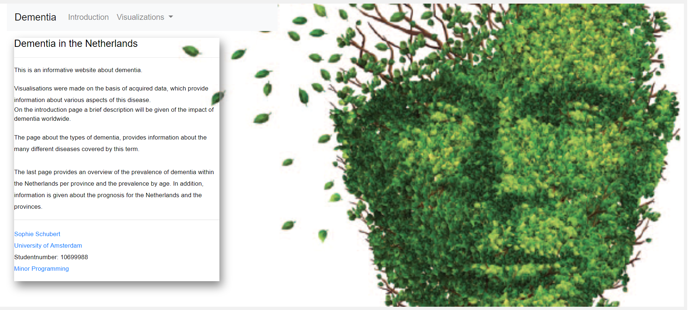

# Programming Project - Dementia in the Netherlands
Course: Programmeerproject  
Name: Sophie Schubert  
Student number: 10699988

## Short description of the application
The idea for this product is to provide information about the impact of dementia, mainly in the Netherlands. Dementia is a global problem, because the number of people with dementia will increase according to prognosis. One main reason is the aging population. The question rises if this is also true for the Netherlands. In README, a more comprehensive description is given.

  

## Visual Design  
At all the pages, I used Bootstrap for a better design. For the homepage, I used bootstrap only for the [navigation bar](https://getbootstrap.com/docs/4.0/components/navbar/). This navigation bar is used at all the pages on the website. At first, I gave the navigation bar a color, which I had learned from [w3schools.com](https://www.w3schools.com/css/css_navbar.asp). Later on, I adjusted it again. This was because I think a slightly light grayish color is more manageable on a white image. The navigation bar includes also a toggle dropdown, which provides the two visualisation pages (introduction and dementia in the netherlands) that I found necessary to place there. The introduction page includes also visualisations, but these are only supporting my problem statement. I placed the [navbar on the image](https://www.w3schools.com/howto/howto_css_navbar_image.asp), created with CSS. On the image, I placed two div tags with text, also on the image. With a CSS tutorial, I added [shadows](https://www.w3schools.com/cssref/css3_pr_box-shadow.asp) to the two 
 elements. In my opinition, this makes the text stand out compared to the navigation bar and the image (gives a depth perception).
For the introduction page as well for the types of dementia page, I used a grid system, learned from a tutorial at [bootstrap.com](https://getbootstrap.com/docs/4.0/layout/grid/). At both page, I chose for 3 columns for the text on the left and for the visualisations 7 columns. In my opinion, this gives the page a nice layout for both the text section and the visualizations.
For the two line graphs at the introduction page, the lines are color coded. This is because the represent different kind of information, which makes it more visual for the user. The same goes for the pie chart at the introduction page.
At the page for the visualisations for dementia in the Netherlands, I didn't use the same grid system from bootstrap. At first, I used this system. However, the visualisations were not placed directly next to each other or below each other. Also with CSS it was not possible to place the visualizations in such a way that they could not overlap. For this page, I used a CSS Grid Layout, which [wraps](https://developer.mozilla.org/en-US/docs/Web/CSS/CSS_Grid_Layout) different 
 tags after another in HTML. In CSS, I displayed a grid and defined grid-template-columns and rows for each 
. In this way it was possible to place the visualizations in a large square, right next to and below each other. For the visualisations at this page, I used only the color code Blue from [colorbrewer](http://colorbrewer2.org/#type=sequential&scheme=BuGn&n=3). At first, I also used the colorbrewer Red. However, in my opinion the website became very messy. Because I chose a white background and to put the visualisations in a grid system with informative text around it, it was easier to appy one color.

## Technical Design  
#### HTML  
The repository has 4 HTML-files, one for each page: the homepage [introduction.html](https://elinesophie.github.io/Project/), the introduction page [introduction.html](https://elinesophie.github.io/Project/static/html/introduction.html), the type of dementia page [typesdementia.html](http://localhost:8888/static/html/typesdementia.html) and the dementia in the Netherlands page [dementianetherlands.html](http://localhost:8888/static/html/dementianetherlands.html). As earlier mentioned, all these pages are connected with each other through the navigation bar of bootstrap.
For the introduction page, I used radio buttons that were being created by html tag <input> with type radio. This was to switch between the two line graphs. I learned the usage of radio buttons earlier at the Minor Program, however, I looked for a better understanding at w3schools.com and different tutorials on youtube.
The dementia in the Netherlands page includes also radio buttons, however, these radiobuttons are connected with each other. These first connection with the dropdown for the choice for gender is made with HTML in combination with Javascript. The technical design for the connections is further explained below.

#### JavaScript  
This repository knows 4 JavaScript-files for each page, all included functions for all the visualisations that are being displayed. Each javascript file is connected to the associated HTML file. These HTML files call the scripts for the visualisations inside the javascript files and placed in the relevant 
 tags for a correct location.
* Introduction.js includes two functions, namely the function for the first line graph and a second function for the second line graph. The script is loaded through introduction.html. These visualizations have been made with approximately the same code. In the beginning I tried to make an update function. This turned out to be very difficult afterwards, because the second line graph contains more lines. This caused a lot of errors with the update.transition() way and the data that was reloaded. That is why I made the choice to write the code separately from each other and to connect this to radiobuttons. With [D3 version 5](https://d3js.org/), a mouse over and mouse out is being created for the lines and for the dots. Hovering over the line will represent the name of the line and hovering over the dots will represent the exact number of people living with dementia.
* Typesdementia.js includes only one function, namely for the pie chart. The script is loaded through typesdementia.html. With [D3 tooltip](https://gist.github.com/davegotz/bd54b56723c154d25eedde6504d30ad7), a mouse over with D3 is being created, where the user can hover over the pies and see the exact percentage of the prevalence.
* Dementianetherlands.js includes most of all the scripts (functions).
  * The function dataMaps draws a map of the Netherlands on a provincial level with topojson. nld.json provides all the coordinates. With the data from datanetherlands.json, de minimum and the maximum amount is being calculated to set variables for the colorscale. The map also includes a mouseover and mouseout, however not with d3 tooltip. The map only could be made with version 3 (I tried it with version 5, but this was not possible). Therefore, I called the map with d3v3 and the rest of the functions with d3v5. This was done in datanetherlands.html. Due to a combination of d3v3 and d3v5, the tooltip of d3 didn't worked. I made the tooltip by hand, creating an html text aspect to display some text (in the form of a string) when hovering with the mouse over a specific province. The map also holds an .on("click") function which is connected to the updatePie and updateLine function, giving these functions new data for the specific province.
  * The function initScatter declares a svg for the scatterplot with margins and graphwidth/height. Inside the SVG, a graph is being placed with different margins. The y and the x scale are being based on the domain of the data that is being given. In this function, the data is hardcoded to give a default for the visualisations at the beginning of the page. Also for the scatterplot, the minimum and the maximum of the total number of dementia patients per 100.000 inhabitants is being calculated to set the colorcoding. This computes the correct color for the scale and connects it to each element in the data seperately. The scatterplot also contains a self-made tooltip, displaying a string on the location of the mouse. The on("click") function will update the LineGraph with data for the specific province that is clicked on.
  * The function initPieChart has a default setting for the Netherlands at the beginning. This pie chart contains data for different age categories. It is connected to the map and will update when the user has clicked on a specific province. The initPie chart also contains a variable legend, where a legend is made for the different categories according the color coding.
  * The function initLine provides a prognosis line, with default Netherlands. Also here, when the user clicks on a specific province within the map, the update function is being called. The same is true when clicked on a dot within the scatterplot.
  * The update functions for the map, the scatterplot, the pie chart and the line graph is the same code as the init-functions, however with an update for given data.
  * The legend functions create a legend for the map and the scatterplot.
* main.js is made for loading all the data for dementianetherlands.js. This was necessary for a better overview of the code (because dementianetherlands includes a lot of code). In main.js, the other dropdown menus are being connected to each other through javascript. With different if statements, the class hide (which will let the drop down menus dissapear) will be set on show when clicked on a specific choice.

#### CSS  
For each HTML file, a CSS-file is connected.
The file for the homepage mainly sets attributs for the image where the navbar is on.
The CSS for the introduction page and the types of dementia page include a inner container, where the shadowing of the box is being set.
The CSS for dementianetherlands contains a wrapper, where different 
 contains rows and columns to make a grid for the visualizations.
In each CSS file, the positioning of elements within the page is being declared.

#### Data  
* Introduction folder
  * Contains python code for converting CSV file to JSON. The data that is within this folder is used for the line graphs; one for the global prevalence prognosis and the other for the continents. Each are organized as a nested dict with name as keys and the values as value object.
* Netherlands folder.
  * Contains also python code for convertin CSV files to JSON. It is used for the data for the map and for the scatterplot, the pie chart and the line graph. Each visualization has it's own dataset. However, the dataset for the map and the scatterplot are the same but with different keys. For the scatterplot, the years are the keys and for the map the province name. The years where necessary to combine it to the dropdowns. On the other hand, the provinces as keys were necessary to combine the code with the map. Prognose.json was used for the line graph, where the years where also set as a key. This made it easer to connect with the map and the scatterplot. Jaarverdeling.json was used for the pie chart, also with years as key.
* Types folder
  * Contains the data for the pie chart for typesdementia.html. It contains also a converter. The csv file was converted to a nested dictionary with the type as key and prevalence as value.

## Process and Development  
#### Challenges  
The challenges that I have had during my project where design, data searching, interactivity and linking of the code.
At the beginning, it was very hard to find the right data for my idea. I started with an idea, searching for data to make it possible. However, I think this was not the right choice.
Linking the visualizations with each other, not using the remove() function, was also a challenge. For dataprocessing as a course, I failed to make an update function. Therefore, I removed the SVG every time I wanted a new graph.

#### Acquired Skills  
I learned a lot of python, how to convert a CSV file to a JSON file. I also learned a lot from D3 and how to loop over de acquired data and make dictionaries.
The things that I learned, which are quite important in my opinion; TOPOjson, work with D3, work with Javascript, HTML, CSS.

## Comparison to DESIGN.md
#### Changes  
* I changed my introduction page. What I first wanted to do:
  * *In this fact sheet you will find data about the number of people with dementia in the Netherlands.
    The data gives an indication of the number of people with dementia in 2018.
    Based on predictions of future population structure, there is also a forecast
    made of the number of people with dementia in the future.
    This clearly demonstrates the importance of understanding about dementia.*
  * I changed this site, to give a broader view about dementia, namely worldwide. I narrowed it down to the Netherlands in the problem statement, with the predictions of future population structures.
* The types of dementia page includes the pie chart which I wanted to make. Building a bar graph was optional, sadly I hadn't enough time to make this.
  * *Optional: bar chart | A bar chart can also be shown on this page, which provides information on what age dementia can occur. Maybe good to do this by type. |A dataset about ages vs dementia is needed. Thereby look for specific types.*
* The page for dementia in the Netherlands has become more extensive.
  * My first plan was :
  Components | Description | Implementation
  ---------- | ----------- | --------------
  Data map | A map of the Netherlands on which all the provinces are shown with different colors. It also has a click function for the provinces. When a province is clicked on, another visualization will update| For the data map we need a map of the provinces of the Netherlands. Thereby, the dataset for the prevalence of dementia for each province is needed.
  Scatterplot | This visualization updates with the click function of the data map. If a province is clicked on, one dot of this scatterplot will become bigger. On the y axis is aging and the prevalence of dementia on the x axis for each province | For this visualization, the same dataset is needed, but combined with another dataset with aging (65 + and 80+).
  Two bar graphs | These visualization will update when clicked on provinces. On one bar graph, aging is being shown for each province and the prevalence. On the other bar graph, men vs women will be shown for each province. | The first dataset can be used.
  * The page stayed roughly the same as that I planned, only for the two bar graphs. The line graph that I had planned on the introduction page (namely the prognosis for the Netherlands) was placed on this page.

#### Defence  
I think that the currect choices for the visualisations presented on each page is more informative than I had planned in DESIGN.md. In addition, I find the introduction and my problem statement better with the global visualizations that I made.
